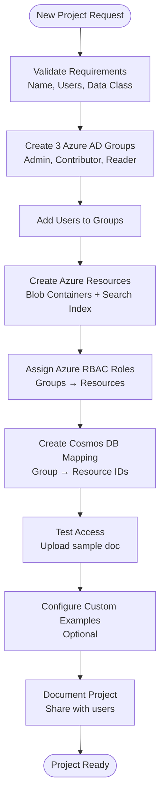

# EVA RBAC - Administrator Guide

**Last Updated**: February 4, 2026  
**Audience**: System Administrators, DevOps, Project Leads  
**Purpose**: Complete guide for managing groups, users, and RBAC configuration

---

## Table of Contents

1. [Overview](#overview)
2. [Prerequisites](#prerequisites)
3. [Creating New Projects](#creating-new-projects)
4. [Managing Groups](#managing-groups)
5. [User Management](#user-management)
6. [Resource Configuration](#resource-configuration)
7. [Monitoring & Auditing](#monitoring--auditing)
8. [Troubleshooting](#troubleshooting)

---

## Overview

As an EVA administrator, you manage:
- **Azure AD Groups** - Define project teams and roles
- **Cosmos DB Mappings** - Link groups to Azure resources
- **Azure Resources** - Blob containers and search indexes
- **User Permissions** - Azure RBAC role assignments
- **Custom Examples** - Per-project prompt suggestions

**Key Principle**: One group → One project → Dedicated resources

---

## Prerequisites

### Required Access

- **Azure AD**: Global Administrator or Groups Administrator
- **Azure Subscription**: Contributor or Owner on EsDAICoESub/EsPAICoESub
- **Cosmos DB**: Data Contributor on groupsToResourcesMap database
- **Storage Account**: Blob Data Contributor for config container
- **DevTools**: Azure CLI, PowerShell, VS Code with Azure extensions

### Required Information

Before creating a project, gather:
- [ ] Project name (e.g., "TestRBAC", "EI Jurisprudence")
- [ ] Organization prefix (e.g., "AICoE", "ESDC")
- [ ] List of users (with email addresses and desired roles)
- [ ] Document volume estimate (for storage/index sizing)
- [ ] Data classification (determines VNet/private endpoint requirements)

---

## Creating New Projects

### Step-by-Step Project Creation



### 1. Create Azure AD Security Groups

**Naming Convention**: `{Organization}_{Role}_{ProjectName}`

**PowerShell Script**:
```powershell
# Variables
$OrgPrefix = "AICoE"
$ProjectName = "TestRBAC"
$Description = "Test RBAC Project for EVA-JP"

# Create 3 groups (Admin, Contributor, Reader)
$roles = @("Admin", "Contributor", "Reader")

foreach ($role in $roles) {
    $groupName = "$OrgPrefix_$($role)_$ProjectName"
    
    # Check if group exists
    $existingGroup = az ad group list --filter "displayName eq '$groupName'" --query "[0]" | ConvertFrom-Json
    
    if ($existingGroup) {
        Write-Host "[EXISTS] Group already exists: $groupName" -ForegroundColor Yellow
        $groupId = $existingGroup.id
    } else {
        # Create group
        $group = az ad group create `
            --display-name $groupName `
            --mail-nickname "$OrgPrefix-$role-$ProjectName" `
            --description "$Description - $role access" `
            | ConvertFrom-Json
        
        $groupId = $group.id
        Write-Host "[CREATED] $groupName - ID: $groupId" -ForegroundColor Green
    }
    
    # Store for later use
    Set-Variable -Name "${role}GroupId" -Value $groupId
}

Write-Host "`n[SUCCESS] All groups created"
Write-Host "Admin Group ID: $AdminGroupId"
Write-Host "Contributor Group ID: $ContributorGroupId"
Write-Host "Reader Group ID: $ReaderGroupId"
```

### 2. Add Users to Groups

**PowerShell Script**:
```powershell
# Add users to groups
$users = @{
    Admin = @("marco.presta@hrsdc-rhdcc.gc.ca", "jane.doe@hrsdc-rhdcc.gc.ca")
    Contributor = @("john.smith@hrsdc-rhdcc.gc.ca", "alice.wong@hrsdc-rhdcc.gc.ca")
    Reader = @("bob.jones@hrsdc-rhdcc.gc.ca")
}

foreach ($role in $users.Keys) {
    $groupId = Get-Variable -Name "${role}GroupId" -ValueOnly
    
    foreach ($userEmail in $users[$role]) {
        # Get user object ID
        $user = az ad user show --id $userEmail --query "id" -o tsv
        
        if ($user) {
            # Add user to group
            az ad group member add --group $groupId --member-id $user
            Write-Host "[ADDED] $userEmail to $role group" -ForegroundColor Green
        } else {
            Write-Host "[ERROR] User not found: $userEmail" -ForegroundColor Red
        }
    }
}
```

### 3. Create Azure Resources

**Create Blob Containers**:
```powershell
# Variables
$StorageAccount = "infoasststoragedev2"
$ResourceGroup = "rg-infoasst-dev2"
$UploadContainer = "upload-testrbac"
$ContentContainer = "content-testrbac"

# Create upload container
az storage container create `
    --name $UploadContainer `
    --account-name $StorageAccount `
    --auth-mode login

# Create content container
az storage container create `
    --name $ContentContainer `
    --account-name $StorageAccount `
    --auth-mode login

Write-Host "[SUCCESS] Blob containers created"
```

**Create Search Index**:
```powershell
# Variables
$SearchService = "infoasst-search-dev2"
$IndexName = "index-testrbac"

# Create index using template
$indexSchema = @"
{
  "name": "$IndexName",
  "fields": [
    {"name": "id", "type": "Edm.String", "key": true},
    {"name": "content", "type": "Edm.String", "searchable": true},
    {"name": "title", "type": "Edm.String", "searchable": true, "filterable": true},
    {"name": "sourcepage", "type": "Edm.String", "filterable": true},
    {"name": "category", "type": "Edm.String", "filterable": true},
    {"name": "embedding", "type": "Collection(Edm.Single)", "dimensions": 1536, "vectorSearchProfile": "default"}
  ],
  "vectorSearch": {
    "algorithms": [{"name": "default", "kind": "hnsw"}],
    "profiles": [{"name": "default", "algorithm": "default"}]
  }
}
"@

$indexSchema | Out-File -FilePath "index-schema.json"

az search index create `
    --service-name $SearchService `
    --name $IndexName `
    --resource-group $ResourceGroup `
    --index-definition @index-schema.json

Write-Host "[SUCCESS] Search index created: $IndexName"
```

### 4. Assign Azure RBAC Roles

**PowerShell Script**:
```powershell
# Get resource IDs
$storageId = az storage account show `
    --name $StorageAccount `
    --resource-group $ResourceGroup `
    --query "id" -o tsv

$searchId = az search service show `
    --name $SearchService `
    --resource-group $ResourceGroup `
    --query "id" -o tsv

# Assign roles to groups
$roleAssignments = @(
    # Admin group
    @{GroupId = $AdminGroupId; Role = "Storage Blob Data Owner"; Scope = "$storageId/blobServices/default/containers/$UploadContainer"},
    @{GroupId = $AdminGroupId; Role = "Storage Blob Data Owner"; Scope = "$storageId/blobServices/default/containers/$ContentContainer"},
    @{GroupId = $AdminGroupId; Role = "Search Index Data Contributor"; Scope = $searchId},
    
    # Contributor group
    @{GroupId = $ContributorGroupId; Role = "Storage Blob Data Contributor"; Scope = "$storageId/blobServices/default/containers/$UploadContainer"},
    @{GroupId = $ContributorGroupId; Role = "Storage Blob Data Reader"; Scope = "$storageId/blobServices/default/containers/$ContentContainer"},
    @{GroupId = $ContributorGroupId; Role = "Search Index Data Reader"; Scope = $searchId},
    
    # Reader group
    @{GroupId = $ReaderGroupId; Role = "Storage Blob Data Reader"; Scope = "$storageId/blobServices/default/containers/$ContentContainer"},
    @{GroupId = $ReaderGroupId; Role = "Search Index Data Reader"; Scope = $searchId}
)

foreach ($assignment in $roleAssignments) {
    az role assignment create `
        --assignee $assignment.GroupId `
        --role $assignment.Role `
        --scope $assignment.Scope
    
    Write-Host "[ASSIGNED] $($assignment.Role) to group on resource" -ForegroundColor Green
}

Write-Host "[SUCCESS] All RBAC roles assigned"
```

### 5. Create Cosmos DB Mappings

**PowerShell Script**:
```powershell
# Create mapping for each role
$mappings = @(
    @{
        id = $AdminGroupId
        group_id = $AdminGroupId
        group_name = "$OrgPrefix_Admin_$ProjectName"
        upload_storage = @{
            upload_container = $UploadContainer
            role = "Storage Blob Data Owner"
        }
        blob_access = @{
            blob_container = $ContentContainer
            role_blob = "Storage Blob Data Owner"
        }
        vector_index_access = @{
            index = $IndexName
            role_index = "Search Index Data Contributor"
        }
    },
    @{
        id = $ContributorGroupId
        group_id = $ContributorGroupId
        group_name = "$OrgPrefix_Contributor_$ProjectName"
        upload_storage = @{
            upload_container = $UploadContainer
            role = "Storage Blob Data Contributor"
        }
        blob_access = @{
            blob_container = $ContentContainer
            role_blob = "Storage Blob Data Reader"
        }
        vector_index_access = @{
            index = $IndexName
            role_index = "Search Index Data Reader"
        }
    },
    @{
        id = $ReaderGroupId
        group_id = $ReaderGroupId
        group_name = "$OrgPrefix_Reader_$ProjectName"
        upload_storage = @{
            upload_container = ""
            role = ""
        }
        blob_access = @{
            blob_container = $ContentContainer
            role_blob = "Storage Blob Data Reader"
        }
        vector_index_access = @{
            index = $IndexName
            role_index = "Search Index Data Reader"
        }
    }
)

# Insert into Cosmos DB using Azure CLI or REST API
$CosmosAccount = "infoasst-cosmos-dev2"
$Database = "groupsToResourcesMap"
$Container = "groupResourcesMapContainer"

foreach ($mapping in $mappings) {
    $mappingJson = $mapping | ConvertTo-Json -Depth 10
    $mappingJson | Out-File -FilePath "mapping-$($mapping.group_name).json"
    
    # Insert using az cosmosdb sql container item create (requires extension)
    # Or use REST API/SDK for production
    
    Write-Host "[CREATED] Mapping for $($mapping.group_name)" -ForegroundColor Green
}
```

### 6. Configure Custom Examples (Optional)

**Edit `config/examplelist.json` in Blob Storage**:
```json
{
    "9f540c2e-e05c-4012-ba43-4846dabfaea6": {
        "title": "Example Questions for TestRBAC",
        "examples": [
            {
                "text": "What is EI misconduct?",
                "value": "Explain misconduct in the context of Employment Insurance eligibility"
            },
            {
                "text": "How do I appeal?",
                "value": "What is the process for appealing an EI decision?"
            }
        ]
    }
}
```

---

## Managing Groups

### Viewing Current Groups

**Azure Portal**:
1. Navigate to Azure Active Directory → Groups
2. Search for your organization prefix (e.g., "AICoE")
3. Click group to view members and properties

**PowerShell**:
```powershell
# List all EVA groups
az ad group list --filter "startswith(displayName, 'AICoE')" --query "[].{Name:displayName, ID:id}" -o table

# Get group members
az ad group member list --group $GroupId --query "[].{Name:displayName, Email:mail}" -o table
```

### Adding/Removing Users

**Add User**:
```powershell
$GroupId = "9f540c2e-e05c-4012-ba43-4846dabfaea6"
$UserEmail = "newuser@hrsdc-rhdcc.gc.ca"

$userId = az ad user show --id $UserEmail --query "id" -o tsv
az ad group member add --group $GroupId --member-id $userId

Write-Host "[ADDED] $UserEmail to group" -ForegroundColor Green
```

**Remove User**:
```powershell
az ad group member remove --group $GroupId --member-id $userId
Write-Host "[REMOVED] $UserEmail from group" -ForegroundColor Yellow
```

### Updating Group Resources

**Update Cosmos DB Mapping**:
```powershell
# Example: Change upload container
$mapping = @{
    id = $GroupId
    group_id = $GroupId
    group_name = "AICoE_Admin_TestRBAC"
    upload_storage = @{
        upload_container = "new-upload-container"  # Changed
        role = "Storage Blob Data Owner"
    }
    # ... rest of mapping
}

# Update in Cosmos DB (replace existing item)
```

**⚠️ Important**: After updating mappings, restart backend to clear cache:
```powershell
az webapp restart --name infoasst-web-dev2 --resource-group rg-infoasst-dev2
```

---

## Resource Configuration

### Storage Account Management

**Check Container Access**:
```powershell
# List role assignments on container
$containerScope = "/subscriptions/$SubscriptionId/resourceGroups/$ResourceGroup/providers/Microsoft.Storage/storageAccounts/$StorageAccount/blobServices/default/containers/$ContainerName"

az role assignment list --scope $containerScope --query "[].{Principal:principalName, Role:roleDefinitionName}" -o table
```

**Monitor Storage Usage**:
```powershell
# Get container metrics
az storage blob list --container-name $ContainerName --account-name $StorageAccount --query "length(@)" -o tsv
```

### Search Index Management

**Check Index Statistics**:
```powershell
# Get document count
az search index statistics --service-name $SearchService --index-name $IndexName --resource-group $ResourceGroup
```

**Rebuild Index** (if needed):
```powershell
# Reset and rebuild index
az search indexer reset --service-name $SearchService --indexer-name $IndexerName --resource-group $ResourceGroup
az search indexer run --service-name $SearchService --indexer-name $IndexerName --resource-group $ResourceGroup
```

---

## Monitoring & Auditing

### User Activity Monitoring

**Cosmos DB Query** (User Profile Activity):
```sql
SELECT c.principal_id, c.current_group, c.last_updated
FROM c
WHERE c.last_updated >= '2026-02-01T00:00:00Z'
ORDER BY c.last_updated DESC
```

**Cosmos DB Query** (Document Upload Activity):
```sql
SELECT c.file_name, c.user_id, c.group_id, c.start_timestamp, c.state
FROM c
WHERE c.start_timestamp >= '2026-02-01T00:00:00Z'
ORDER BY c.start_timestamp DESC
```

### Application Insights Queries

**User Login Events**:
```kusto
traces
| where timestamp > ago(7d)
| where message contains "getUsrGroupInfo"
| project timestamp, message, user_AuthenticatedId
| order by timestamp desc
```

**Authorization Failures**:
```kusto
exceptions
| where timestamp > ago(7d)
| where outerMessage contains "403" or outerMessage contains "not authorized"
| project timestamp, outerMessage, user_AuthenticatedId
| order by timestamp desc
```

### Cost Monitoring

**Cosmos DB RU/s Usage**:
```powershell
# Get current throughput
az cosmosdb sql container throughput show `
    --account-name $CosmosAccount `
    --database-name $Database `
    --name $Container `
    --resource-group $ResourceGroup
```

---

## Troubleshooting

### Common Admin Issues

#### Issue 1: User Can't See Any Groups

**Symptoms**: User logs in but sees "You are not assigned to any project"

**Resolution**:
1. Verify user is in Azure AD group: `az ad group member list --group $GroupId`
2. Verify group has Cosmos DB mapping: Query groupResourcesMapContainer
3. Verify Azure RBAC roles assigned: `az role assignment list --assignee $GroupId`
4. Clear backend cache: Restart web app

#### Issue 2: User Can't Upload Documents

**Symptoms**: 403 error on upload

**Resolution**:
1. Check user's role (Reader can't upload)
2. Verify upload_container in Cosmos DB mapping
3. Verify Azure RBAC role on upload container:
   ```powershell
   az role assignment list --scope $containerScope --assignee $GroupId
   ```

#### Issue 3: Documents Not Appearing in Search

**Symptoms**: Upload succeeds but documents not searchable

**Resolution**:
1. Check document processing status in statuscontainer
2. Verify Azure Functions running: `az functionapp list --query "[?state=='Running']"`
3. Check indexer status: `az search indexer status`
4. Review function logs for errors

---

## Best Practices

### Security

- ✅ Use **principle of least privilege** - Start with Reader, upgrade as needed
- ✅ Review group membership **quarterly**
- ✅ Enable **Azure AD Conditional Access** for sensitive projects
- ✅ Use **private endpoints** for production (HCCLD2)
- ✅ Enable **audit logging** in Application Insights

### Performance

- ✅ Limit groups per user to **5 or fewer**
- ✅ Use **dedicated containers/indexes** per project (avoid sharing)
- ✅ Monitor **Cosmos DB RU/s** and scale as needed
- ✅ Enable **search index autoscale** for variable workloads

### Operations

- ✅ Document all projects in **centralized registry**
- ✅ Use **naming conventions** consistently
- ✅ Test access after every change
- ✅ Maintain **backup scripts** for all configurations
- ✅ Schedule **monthly access reviews**

---

## Quick Reference

### Essential Commands

```powershell
# Create group
az ad group create --display-name "AICoE_Admin_ProjectName" --mail-nickname "aicoe-admin-project"

# Add user to group
az ad group member add --group $GroupId --member-id $UserId

# Assign RBAC role
az role assignment create --assignee $GroupId --role "Storage Blob Data Owner" --scope $ResourceScope

# Restart backend (clear cache)
az webapp restart --name infoasst-web-dev2 --resource-group rg-infoasst-dev2

# Query Cosmos DB
az cosmosdb sql container query --account-name $CosmosAccount --database-name $Database --name $Container --query-string "SELECT * FROM c WHERE c.group_name = 'AICoE_Admin_TestRBAC'"
```

---

**For Support**: Marco Presta (marco.presta@hrsdc-rhdcc.gc.ca)  
**Related Docs**: [README.md](README.md) | [USER-GUIDE.md](USER-GUIDE.md) | [TROUBLESHOOTING.md](TROUBLESHOOTING.md)
