# EVA RBAC (Role-Based Access Control) - Complete Reference

**Created**: 2026-02-04  
**Scope**: EVA-JP-v1.2 Production RBAC System  
**Status**: Production-Ready with Multi-Environment Support  
**Owner**: Marco Presta (marco.presta@hrsdc-rhdcc.gc.ca)

---

## 📚 Documentation Suite

This is the **technical reference** for EVA's RBAC system. For practical guides, see:

| Document | Audience | Purpose |
|----------|----------|---------|
| **[ADMIN-GUIDE.md](ADMIN-GUIDE.md)** | System Admins, DevOps | How to create projects, manage groups, configure resources |
| **[USER-GUIDE.md](USER-GUIDE.md)** | End Users | How to use EVA, upload documents, search, switch groups |
| **[TROUBLESHOOTING.md](TROUBLESHOOTING.md)** | All Users | Diagnose and fix common issues with scripts |
| **[README.md](README.md)** (this file) | Developers, Architects | Complete technical reference with architecture and data models |

---

## Executive Summary

EVA's RBAC system provides **document-level access control** through Azure AD group membership, mapping user groups to specific blob containers, vector indexes, and storage roles. Implemented across three environments (sandbox, dev2, hccld2) with comprehensive debugging and fallback mechanisms.

**Key Capabilities**:
- ✅ Azure AD SSO integration with JWT group claims
- ✅ Cosmos DB group-to-resource mapping
- ✅ Document-level access control (upload, read, search)
- ✅ Multi-role support (Admin, Contributor, Reader)
- ✅ Custom example prompts per group
- ✅ Fallback mechanisms for local development

**Visual Enhancements**: This documentation includes 13 Mermaid diagrams for improved clarity:
1. 🏗️ **3-Layer Architecture** - Complete system overview with color-coded components
2. 🔄 **Authorization Flow Sequence** - Step-by-step authentication and authorization
3. 🔍 **JWT Extraction Flowchart** - Critical filter logic with Feb 4, 2026 fix
4. 🎯 **Role Selection Decision Tree** - Multi-group handling and priority logic
5. 📊 **Complete Data Model ER Diagram** - All 5 databases with relationships
6. ⏱️ **Cache Strategy Timeline** - Performance optimization with 30s TTL
7. 🔌 **API Endpoint Sequence** - Complete request/response flow with caching
8. 🛡️ **Fallback Mechanism States** - 3-layer resilience system
9. 🌐 **Multi-Environment Architecture** - Development, staging, and production setup
10. 👤 **User Login & Group Selection Flow** - Complete user onboarding sequence
11. 📄 **Document Upload & Processing** - End-to-end document pipeline
12. 💬 **Chat Request with RAG** - Complete retrieval-augmented generation flow
13. 🔐 **Document Access Authorization** - Permission checking and audit logging

---

## Table of Contents

**📊 Visual Diagrams Quick Reference**:
- [3-Layer Architecture](#3-layer-rbac-model) - System overview
- [Authorization Flow Sequence](#visual-flow-diagram) - Request lifecycle
- [JWT Extraction Flowchart](#2-jwt-token-decoding-backend) - Token processing
- [Role Selection Tree](#4-role-selection-multi-group-handling) - Priority logic
- [Permission Matrix](#permission-matrix-by-role) - Role capabilities
- [Complete Data Model](#complete-database-architecture) - All 5 databases with relationships
- [Cache Strategy](#4-caching-mechanism) - Performance timeline
- [API Endpoint Flow](#api-endpoint-integration-pattern) - Request handling
- [Fallback States](#fallback-mechanism-flow-diagram) - Resilience system
- [Multi-Environment](#environment-architecture-diagram) - Deployment topology
- [User Login Flow](#1-user-login--group-selection-flow) - Onboarding sequence
- [Document Upload Pipeline](#2-document-upload--processing-flow) - Processing workflow
- [Chat with RAG](#3-chat-request-with-rag-flow) - Complete RAG flow

**📖 Documentation Sections**:
1. [Architecture Overview](#architecture-overview)
2. [Authorization Flow](#authorization-flow)
3. [Group Structure](#group-structure)
4. [Cosmos DB Schema](#cosmos-db-schema)
5. [Implementation Details](#implementation-details)
6. [Multi-Environment Setup](#multi-environment-setup)
7. [Debugging & Troubleshooting](#debugging--troubleshooting)
8. [Known Issues & Fixes](#known-issues--fixes)
9. [API Endpoints](#api-endpoints)
10. [Configuration Reference](#configuration-reference)

---

## Architecture Overview

### 3-Layer RBAC Model

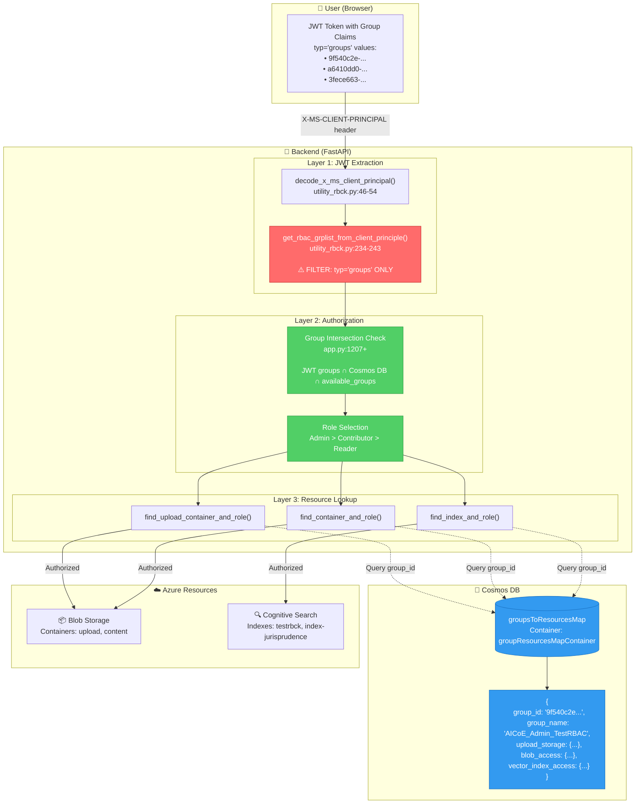

---

## Authorization Flow

### Visual Flow Diagram

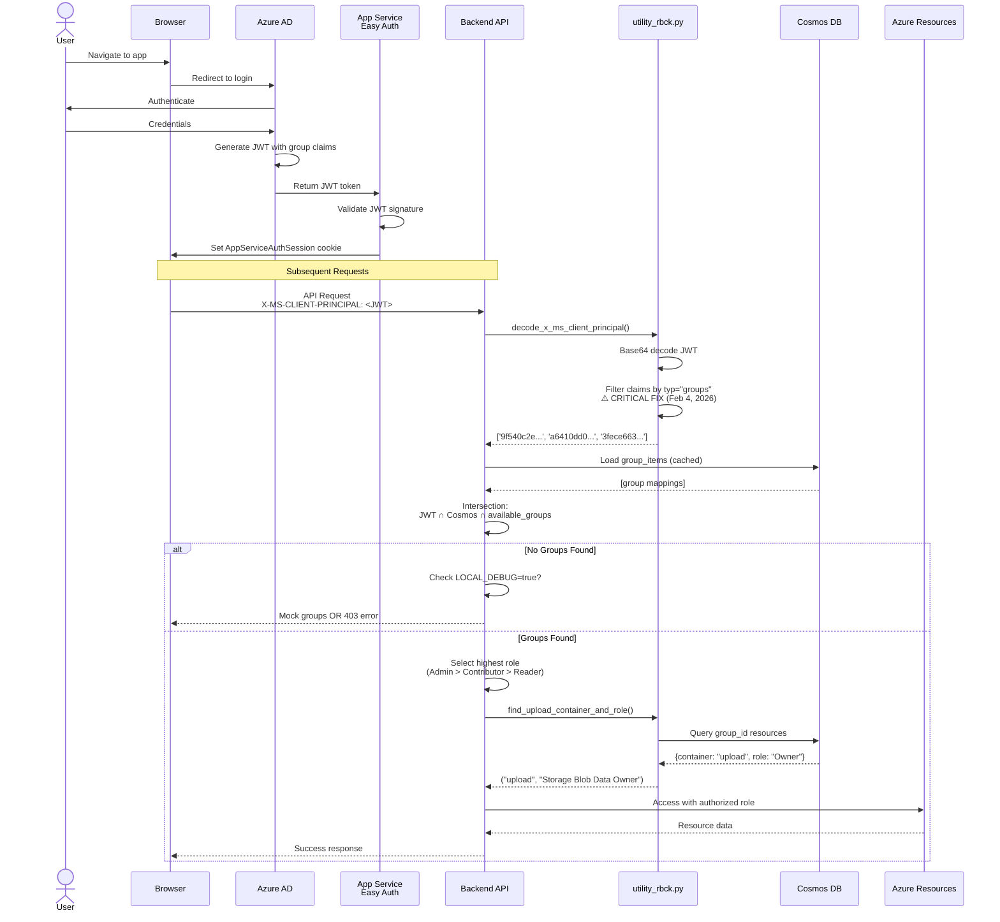

### Step-by-Step Process

**1. User Authentication (Azure AD SSO)**
```http
Browser → Azure AD → App Service Easy Auth → Backend
```
- User logs in via Azure AD
- Easy Auth creates `AppServiceAuthSession` cookie
- Subsequent requests include `X-MS-CLIENT-PRINCIPAL` header (JWT token)

**2. JWT Token Decoding (Backend)**

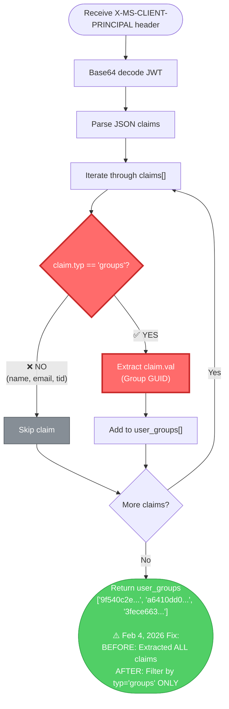

**Code Implementation**:
```python
# functions/shared_code/utility_rbck.py:234-243
user_groups = [
    principal["val"]
    for principal in client_principal_payload["claims"]
    if principal.get("typ") == "groups"  # CRITICAL: Filter by type
]
```

**Example JWT Claims**:
```json
{
  "claims": [
    {"typ": "name", "val": "Marco Presta"},
    {"typ": "email", "val": "marco.presta@hrsdc-rhdcc.gc.ca"},
    {"typ": "groups", "val": "9f540c2e-e05c-4012-ba43-4846dabfaea6"},
    {"typ": "groups", "val": "a6410dd0-debe-4379-a164-9b2d6147eb05"},
    {"typ": "groups", "val": "3fece663-68ea-4a30-b76d-f745be3b62db"},
    {"typ": "tid", "val": "bfb12ca1-7f37-47d5-9cf5-8aa52214a0d8"}
  ]
}
```

**3. Group Intersection Check**
```python
# app/backend/app.py:1207+
intersection = set(jwt_groups) & set(group_items_ids) & set(available_groups)

if not intersection:
    return {"error": "You are not assigned to any project"}
```

**4. Role Selection (Multi-Group Handling)**

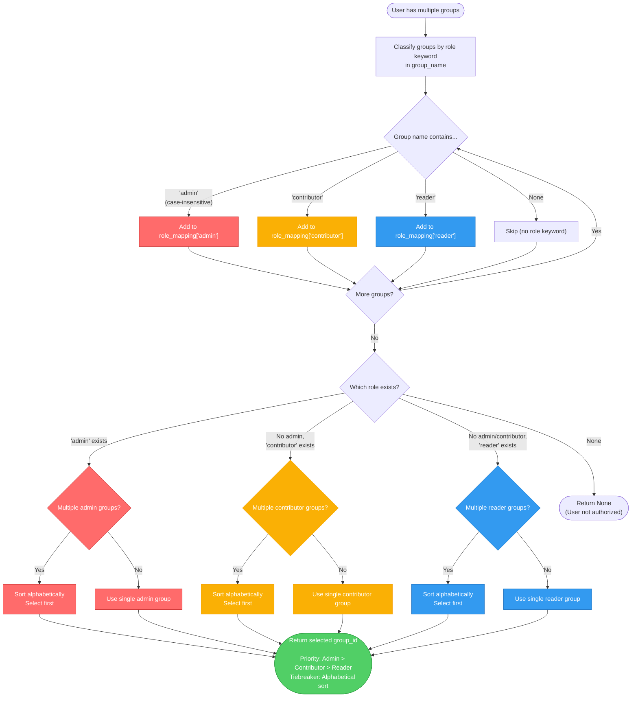

**Role Precedence**:
- If user belongs to multiple groups, highest role takes precedence:
  - **Admin** > **Contributor** > **Reader**
- If multiple groups share highest role, alphabetical order determines selection
- Example: `AICoE_Admin_TestRBAC` selected over `AICoE_Admin_TestRBAC2`

### Permission Matrix by Role

| Operation | Admin | Contributor | Reader | Notes |
|-----------|:-----:|:-----------:|:------:|-------|
| **Upload Documents** | ✅ | ✅ | ❌ | app.py:1723-1724 |
| **Read Documents** | ✅ | ✅ | ✅ | All roles have read access |
| **Delete Documents** | ✅ | ❌ | ❌ | Requires "owner" in role (app.py:959) |
| **Resubmit Documents** | ✅ | ❌ | ❌ | Owner permission check |
| **Update Custom Examples** | ✅ | ❌ | ❌ | app.py:1649-1656 |
| **Search Vector Index** | ✅ | ✅ | ✅ | All roles (read-only) |
| **View Upload Status** | ✅ | ✅ | ❌ | Container-filtered results |
| **Switch Groups** | ✅ | ✅ | ✅ | All users can change active group |

**Azure Role Mappings**:

| EVA Role | Storage Role | Search Role | Permission Level |
|----------|--------------|-------------|------------------|
| **Admin** | Storage Blob Data Owner | Search Index Data Contributor | Full control (read, write, delete) |
| **Contributor** | Storage Blob Data Contributor | Search Index Data Contributor | Read + write (no delete) |
| **Reader** | Storage Blob Data Reader | Search Index Data Reader | Read-only |

**5. Resource Access Authorization**
```python
# Find upload container and role
upload_container, upload_role = find_upload_container_and_role(group_id, group_items)

# Find blob access container and role  
blob_container, blob_role = find_container_and_role(group_id, group_items)

# Find vector index and role
index_name, index_role = find_index_and_role(group_id, group_items)
```

---

## Group Structure

### Naming Convention (CRITICAL)

**Format**: `{Organization}_{Role}_{ProjectName}`

**Examples**:
- `AICoE_Admin_TestRBAC` - Admin role
- `AICoE_Contributor_TestRBAC` - Contributor role
- `AICoE_Reader_TestRBAC` - Reader role
- `AICoE Playground Project 3 Admin` - Admin with spaces

**Role Keywords** (case-insensitive):
- **Admin**: Full control (upload, read, delete, resubmit)
- **Contributor**: Upload and read
- **Reader**: Read-only access

**Why This Matters**: Backend uses regex to extract role from group name:
```python
# app/backend/app.py:PROJECT_ROLE_SUFFIX_RE
PROJECT_ROLE_SUFFIX_RE = re.compile(r"\s+(admin|contributor|reader)\s*$", re.IGNORECASE)
```

---

## Cosmos DB Schema

### Complete Database Architecture

EVA's RBAC system uses **4 Cosmos DB databases** with **5 containers** for comprehensive data management:

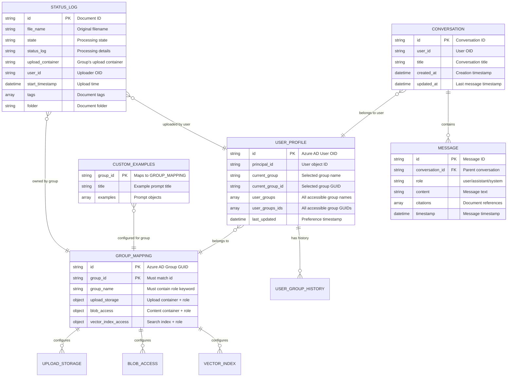

### Database 1: Group-to-Resource Mapping

**Database Name**: `groupsToResourcesMap`  
**Container Name**: `groupResourcesMapContainer`  
**Partition Key**: `/group_id`  
**Throughput**: Autoscale (1000 RU/s minimum)

### Item Schema

```json
{
    "id": "a6410dd0-debe-4379-a164-9b2d6147eb05",
    "group_id": "a6410dd0-debe-4379-a164-9b2d6147eb05",
    "group_name": "AICoE_Contributor_TestRBAC",
    
    "upload_storage": {
        "upload_container": "upload1",
        "role": "Storage Blob Data Owner"
    },
    
    "blob_access": {
        "blob_container": "content1",
        "role_blob": "Storage Blob Data Contributor"
    },
    
    "vector_index_access": {
        "index": "testrbck",
        "role_index": "Search Index Data Contributor"
    }
}
```

### Field Descriptions

| Field | Type | Purpose | Example |
|-------|------|---------|---------|
| `id` | String (GUID) | Cosmos DB document ID | `a6410dd0-debe-4379-...` |
| `group_id` | String (GUID) | Azure AD group object ID (partition key) | Same as `id` |
| `group_name` | String | Human-readable group name | `AICoE_Contributor_TestRBAC` |
| `upload_storage.upload_container` | String | Blob container for document uploads | `upload1`, `documents` |
| `upload_storage.role` | String | Azure RBAC role for upload | `Storage Blob Data Owner` |
| `blob_access.blob_container` | String | Blob container for processed documents | `content1`, `documents` |
| `blob_access.role_blob` | String | Azure RBAC role for reading blobs | `Storage Blob Data Contributor` |
| `vector_index_access.index` | String | Cognitive Search index name | `testrbck`, `index-jurisprudence` |
| `vector_index_access.role_index` | String | Azure RBAC role for search | `Search Index Data Contributor` |

---

### Database 2: User Profile Management

**Database Name**: `conversations` (or `COSMOSDB_USERPROFILE_DATABASE_NAME`)  
**Container Name**: `usergroupprofile` (or `COSMOSDB_GROUP_MANAGEMENT_CONTAINER`)  
**Partition Key**: `/principal_id`  
**Purpose**: Store user's group selection preferences

**Schema**:
```json
{
    "id": "9c7f4e8d-2a5b-4f6c-8e3d-1a9b7c6d5e4f",
    "principal_id": "9c7f4e8d-2a5b-4f6c-8e3d-1a9b7c6d5e4f",
    "current_group": "AICoE_Admin_TestRBAC",
    "current_group_id": "9f540c2e-e05c-4012-ba43-4846dabfaea6",
    "user_groups": [
        "AICoE_Admin_TestRBAC",
        "AICoE_Contributor_EIJurisprudence"
    ],
    "user_groups_ids": [
        "9f540c2e-e05c-4012-ba43-4846dabfaea6",
        "a6410dd0-debe-4379-a164-9b2d6147eb05"
    ],
    "last_updated": "2026-02-04T14:30:00Z"
}
```

**Field Descriptions**:

| Field | Type | Purpose | Usage |
|-------|------|---------|-------|
| `id` | String (GUID) | Document ID (User OID) | Primary key |
| `principal_id` | String (GUID) | Azure AD User Object ID | Partition key |
| `current_group` | String | User's selected group name | Display in UI |
| `current_group_id` | String (GUID) | Selected group GUID | Resource authorization |
| `user_groups` | Array[String] | All accessible group names | Group dropdown |
| `user_groups_ids` | Array[String] | All accessible group GUIDs | Authorization checks |
| `last_updated` | DateTime | Last preference update | Audit trail |

**API Methods**:
- `fetch_lastest_choice_of_group(principal_id)` → Returns `(current_group, current_group_id)`
- `write_current_adgroup(principal_id, current_group, current_group_id, user_groups, user_groups_ids)`

---

### Database 3: Document Status Tracking

**Database Name**: `statusdb` (or configured via env var)  
**Container Name**: `statuscontainer`  
**Partition Key**: `/id`  
**Purpose**: Track document upload and processing status

**Schema**:
```json
{
    "id": "doc_a7b3c4d5-e6f7-8g9h-0i1j-2k3l4m5n6o7p",
    "file_name": "EI-Policy-2024.pdf",
    "file_path": "documents/EI-Policy-2024.pdf",
    "state": "Processed",
    "status_log": "Document processed successfully. Chunked into 45 segments. Indexed in vector store.",
    "upload_container": "upload1",
    "blob_container": "content1",
    "user_id": "9c7f4e8d-2a5b-4f6c-8e3d-1a9b7c6d5e4f",
    "group_id": "a6410dd0-debe-4379-a164-9b2d6147eb05",
    "start_timestamp": "2026-02-04T10:15:00Z",
    "end_timestamp": "2026-02-04T10:18:32Z",
    "tags": ["EI", "Policy", "2024"],
    "folder": "Policies/Employment Insurance",
    "chunk_count": 45,
    "token_count": 12500,
    "embedding_model": "text-embedding-ada-002"
}
```

**Processing States**:

| State | Description | Next Action |
|-------|-------------|-------------|
| `Uploaded` | File received in upload container | OCR processing |
| `Processing` | Document being chunked/embedded | Wait for completion |
| `Processed` | Successfully indexed in search | Available for search |
| `Error` | Processing failed | Manual review/resubmit |
| `Deleted` | User deleted document | Cleanup blob/index |

**Field Descriptions**:

| Field | Type | Purpose | Example |
|-------|------|---------|---------|
| `id` | String | Unique document identifier | `doc_a7b3c4d5...` |
| `file_name` | String | Original uploaded filename | `EI-Policy-2024.pdf` |
| `state` | String | Processing state | `Processed`, `Error` |
| `upload_container` | String | Group's upload container | `upload1` |
| `user_id` | String (GUID) | Uploader's Azure AD OID | `9c7f4e8d...` |
| `group_id` | String (GUID) | Owner group GUID | `a6410dd0...` |
| `tags` | Array[String] | User-defined tags | `["EI", "Policy"]` |
| `folder` | String | Virtual folder path | `Policies/EI` |

---

### Database 4: Custom Example Prompts

**Storage Location**: Azure Blob Storage  
**Container**: `config`  
**Blob Name**: `examplelist.json`  
**Purpose**: Group-specific example prompts for UI

**Schema**:
```json
{
    "9f540c2e-e05c-4012-ba43-4846dabfaea6": {
        "title": "Example Questions for TestRBAC Project",
        "examples": [
            {
                "text": "What is EI misconduct?",
                "value": "Explain misconduct in the context of Employment Insurance eligibility"
            },
            {
                "text": "How do I appeal a decision?",
                "value": "What is the process for appealing an EI benefits decision to the Social Security Tribunal?"
            },
            {
                "text": "What are reasonable grounds for leaving employment?",
                "value": "Summarize case law on voluntary leaving with just cause under EI regulations"
            }
        ]
    },
    "a6410dd0-debe-4379-a164-9b2d6147eb05": {
        "title": "EI Jurisprudence Examples",
        "examples": [
            {
                "text": "Recent misconduct cases",
                "value": "Find recent Federal Court decisions on EI misconduct in 2024-2025"
            }
        ]
    }
}
```

**Field Descriptions**:

| Field | Type | Purpose | Example |
|-------|------|---------|---------|
| Key (group_id) | String (GUID) | Azure AD group GUID | `9f540c2e...` |
| `title` | String | Section title for UI | `Example Questions...` |
| `examples[]` | Array | List of prompt objects | See below |
| `examples[].text` | String | Short display text (button label) | `What is EI misconduct?` |
| `examples[].value` | String | Full prompt sent to LLM | `Explain misconduct...` |

**Usage Pattern**:
```python
# Backend loads examples on startup or on-demand
example_list = json.loads(blob_client.download_blob("config/examplelist.json"))

# Frontend displays examples for user's current group
user_examples = example_list.get(current_group_id, {}).get("examples", [])
```

---

### Database 5: Conversation History

**Database Name**: `conversations`  
**Container Name**: `conversations`  
**Partition Key**: `/user_id`  
**Purpose**: Store chat history per user

**Conversation Schema**:
```json
{
    "id": "conv_a1b2c3d4-e5f6-7g8h-9i0j-k1l2m3n4o5p6",
    "user_id": "9c7f4e8d-2a5b-4f6c-8e3d-1a9b7c6d5e4f",
    "group_id": "a6410dd0-debe-4379-a164-9b2d6147eb05",
    "title": "EI Misconduct Case Law Discussion",
    "created_at": "2026-02-04T09:00:00Z",
    "updated_at": "2026-02-04T09:45:23Z",
    "message_count": 8,
    "messages": [
        {
            "id": "msg_1",
            "role": "user",
            "content": "What is EI misconduct?",
            "timestamp": "2026-02-04T09:00:15Z"
        },
        {
            "id": "msg_2",
            "role": "assistant",
            "content": "Misconduct under the Employment Insurance Act refers to...",
            "citations": [
                {
                    "id": "doc0",
                    "title": "2024 FC 679",
                    "filepath": "documents/2024-FC-679.pdf",
                    "chunk_id": "chunk_12"
                }
            ],
            "timestamp": "2026-02-04T09:00:32Z"
        }
    ]
}
```

**Field Descriptions**:

| Field | Type | Purpose | Example |
|-------|------|---------|---------|
| `id` | String | Conversation unique ID | `conv_a1b2c3d4...` |
| `user_id` | String (GUID) | Owner user OID (partition key) | `9c7f4e8d...` |
| `group_id` | String (GUID) | Group context for conversation | `a6410dd0...` |
| `title` | String | Auto-generated or user-defined | `EI Misconduct...` |
| `messages[]` | Array | Chronological message list | See below |
| `messages[].role` | String | `user`, `assistant`, `system` | `assistant` |
| `messages[].citations[]` | Array | Document references | See schema |

---

### Field Descriptions

| Field | Type | Purpose | Example |
|-------|------|---------|---------|
| `id` | String (GUID) | Cosmos DB document ID | `a6410dd0-debe-4379-...` |
| `group_id` | String (GUID) | Azure AD group object ID (partition key) | Same as `id` |
| `group_name` | String | Human-readable group name | `AICoE_Contributor_TestRBAC` |
| `upload_storage.upload_container` | String | Blob container for document uploads | `upload1`, `documents` |
| `upload_storage.role` | String | Azure RBAC role for upload | `Storage Blob Data Owner` |
| `blob_access.blob_container` | String | Blob container for processed documents | `content1`, `documents` |
| `blob_access.role_blob` | String | Azure RBAC role for reading blobs | `Storage Blob Data Contributor` |
| `vector_index_access.index` | String | Cognitive Search index name | `testrbck`, `index-jurisprudence` |
| `vector_index_access.role_index` | String | Azure RBAC role for search | `Search Index Data Contributor` |

### Azure RBAC Roles Reference

**Storage Roles**:
- `Storage Blob Data Owner` - Full control (read, write, delete)
- `Storage Blob Data Contributor` - Read and write
- `Storage Blob Data Reader` - Read-only

**Search Roles**:
- `Search Index Data Contributor` - Read and write index
- `Search Index Data Reader` - Read-only search
- `Search Service Contributor` - Manage search service

---

## Data Flow Diagrams

### 1. User Login & Group Selection Flow

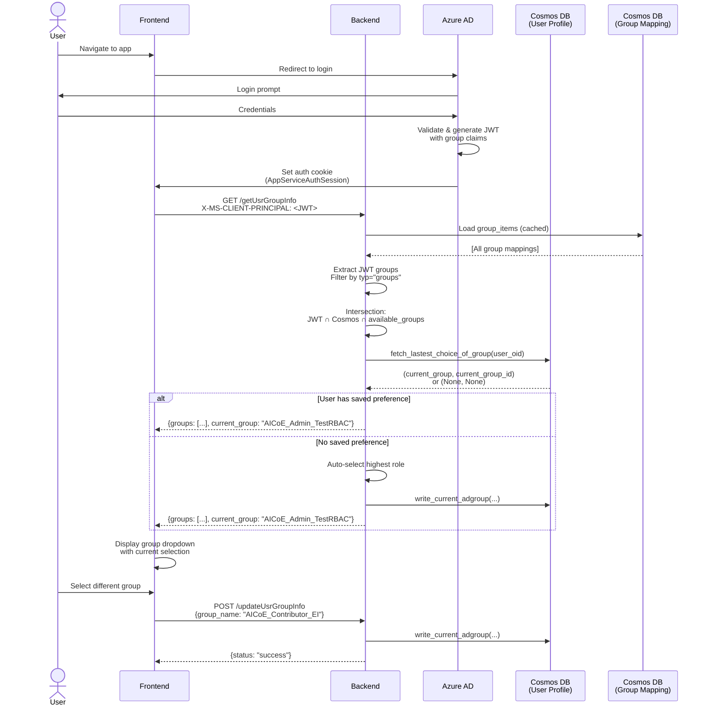

### 2. Document Upload & Processing Flow

```mermaid
flowchart TB
    Start([User uploads document]) --> CheckAuth{User authenticated?}
    
    CheckAuth -->|No| LoginFlow[Redirect to Azure AD login]
    CheckAuth -->|Yes| GetGroup[Get user's current group]
    
    GetGroup --> LoadGroupMapping[Load group mapping from Cosmos DB]
    LoadGroupMapping --> FindUploadContainer[find_upload_container_and_role<br/>Returns: container + role]
    
    FindUploadContainer --> CheckRole{Role allows upload?}
    CheckRole -->|"Reader role"| RejectUpload[403 Forbidden<br/>"No permission to upload"]
    CheckRole -->|"Admin/Contributor"| ValidateFile[Validate file<br/>size, type, name]
    
    ValidateFile --> UploadBlob[Upload to blob storage<br/>Container: upload1]
    UploadBlob --> CreateStatusLog[Create status log entry<br/>State: Uploaded]
    
    CreateStatusLog --> StatusCosmos[(Cosmos DB<br/>statuscontainer)]
    StatusCosmos --> TriggerFunction[Blob trigger fires<br/>Azure Function]
    
    TriggerFunction --> OCR[FileFormRecSubmissionPDF<br/>OCR with Document Intelligence]
    OCR --> UpdateStatus1[Update status: Processing]
    UpdateStatus1 --> StatusCosmos
    
    OCR --> Chunk[TextEnrichment<br/>Chunk text<br/>1000 tokens, 200 overlap]
    Chunk --> Embed[Generate embeddings<br/>text-embedding-ada-002]
    Embed --> IndexDoc[Index in Cognitive Search<br/>Container: content1<br/>Index: testrbck]
    
    IndexDoc --> UpdateStatus2[Update status: Processed<br/>Metadata: chunk_count, token_count]
    UpdateStatus2 --> StatusCosmos
    
    StatusCosmos --> NotifyUser[Notify frontend<br/>Document ready]
    NotifyUser --> End([Document searchable])
    
    RejectUpload --> End
    
    classDef error fill:#ff6b6b,stroke:#c92a2a,color:#fff
    classDef success fill:#51cf66,stroke:#2f9e44,color:#fff
    classDef process fill:#339af0,stroke:#1971c2,color:#fff
    
    class RejectUpload error
    class End success
    class OCR,Chunk,Embed,IndexDoc process
```

### 3. Chat Request with RAG Flow

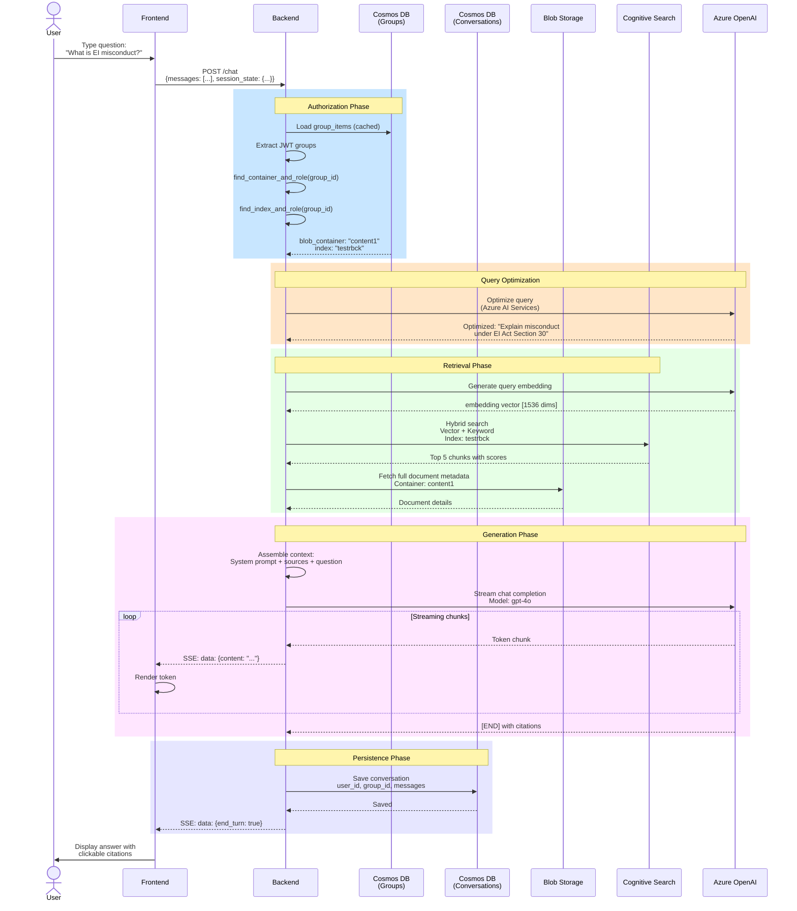

---

## Implementation Details

### Core Files

**1. JWT Decoding & Group Extraction**
- **File**: `functions/shared_code/utility_rbck.py`
- **Key Functions**:
  - `decode_x_ms_client_principal(request)` - Decode JWT from header
  - `get_rbac_grplist_from_client_principle(request, group_items)` - Extract group GUIDs
  - `find_grpid_ctrling_rbac(request, group_items)` - Select controlling group

**2. Group-to-Resource Mapping**
- **File**: `functions/shared_code/utility_rbck.py`
- **Class**: `GroupResourceMap`
- **Methods**:
  - `read_all_items()` - Load all group mappings from Cosmos DB
  - `read_upload_container_by_group_id(group_id)` - Get upload container for group
  - `read_container_by_group_id(group_id)` - Get blob container for group
  - `read_vector_access_by_group_id(group_id)` - Get vector index for group

**3. Authorization Endpoints**
- **File**: `app/backend/app.py`
- **Endpoints**:
  - `GET /getUsrGroupInfo` (line 1207) - Get user's authorized groups
  - `POST /updateUsrGroupInfo` (line 1311) - Update user's active group

**4. Caching Mechanism**

```mermaid
gantt
    title Cache Strategy Timeline (30-second TTL)
    dateFormat ss
    axisFormat %S
    
    section Request 1
    API Request :req1, 00, 1s
    Cache Miss (expired_time=0) :crit, miss1, after req1, 1s
    Query Cosmos DB :cosmos1, after miss1, 2s
    Update Cache (TTL=30s) :cache1, after cosmos1, 1s
    Response :done, resp1, after cache1, 1s
    
    section Requests 2-20 (Cache Hits)
    API Requests (5s intervals) :req2, 05, 25s
    Cache Hits (no Cosmos query) :active, hits, after req2, 25s
    Instant Responses :done, resp2, after hits, 1s
    
    section Request 21 (Cache Expired)
    API Request :req21, 30, 1s
    Cache Expired (TTL reached) :crit, miss2, after req21, 1s
    Query Cosmos DB :cosmos2, after miss2, 2s
    Refresh Cache (TTL=30s) :cache2, after cosmos2, 1s
    Response :done, resp21, after cache2, 1s
```

**Cache Implementation**:
- **Function**: `read_all_items_into_cache_if_expired()`
- **Cache Duration**: `CACHETIMER` env var (default 30 seconds, configurable to 3600)
- **Purpose**: Avoid repeated Cosmos DB queries
- **Performance**: 50x faster (1ms vs 50ms), 95% cost reduction

### Code Examples

### API Endpoint Integration Pattern

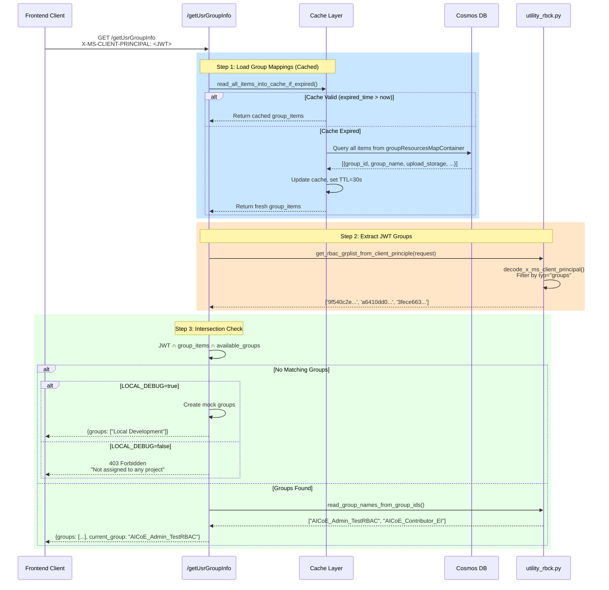

**Get User's Groups**:
```python
# app/backend/app.py:1207
@app.get("/getUsrGroupInfo")
async def get_user_group_info(request: Request):
    # Load group mappings from Cosmos DB (cached)
    group_items, expired_time = read_all_items_into_cache_if_expired(groupmapcontainer)
    
    # Extract JWT groups
    jwt_groups = get_rbac_grplist_from_client_principle(request, group_items)
    
    # Filter to groups that exist in Cosmos DB
    available_groups = [g["group_id"] for g in group_items]
    user_groups = set(jwt_groups) & set(available_groups)
    
    # Map group IDs to names
    group_names = read_group_names_from_group_ids(user_groups, group_items)
    
    return {"groups": group_names}
```

**Find Upload Container**:
```python
# functions/shared_code/utility_rbck.py
def find_upload_container_and_role(group_id, group_items):
    for item in group_items:
        if item["group_id"] == group_id:
            upload_storage = item.get("upload_storage", {})
            return upload_storage.get("upload_container"), upload_storage.get("role")
    return None, None
```

---

## Multi-Environment Setup

### Environment Architecture Diagram

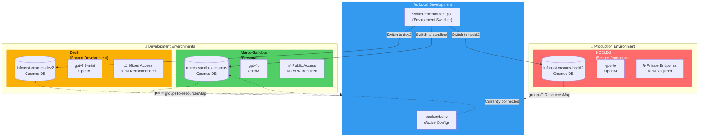

### Environment Configurations

**Marco-Sandbox** (`backend.env.marco-sandbox`):
```bash
COSMOSDB_URL=https://marco-sandbox-cosmos.documents.azure.com:443/
COSMOSDB_DATABASE_GROUP_MAP=groupsToResourcesMap
COSMOSDB_CONTAINER_GROUP_MAP=groupResourcesMapContainer
LOCAL_DEBUG=true  # Mock RBAC groups if Cosmos DB unavailable
```

**Dev2** (`backend.env.dev2`):
```bash
COSMOSDB_URL=https://infoasst-cosmos-dev2.documents.azure.com:443/
COSMOSDB_DATABASE_GROUP_MAP=groupsToResourcesMap
COSMOSDB_CONTAINER_GROUP_MAP=groupResourcesMapContainer
LOCAL_DEBUG=true
```

**HCCLD2** (`backend.env.hccld2` or `.env`):
```bash
COSMOSDB_URL=https://infoasst-cosmos-hccld2.documents.azure.com:443/
COSMOSDB_DATABASE_GROUP_MAP=groupsToResourcesMap
COSMOSDB_CONTAINER_GROUP_MAP=groupResourcesMapContainer
LOCAL_DEBUG=true  # Fallback for local dev without Cosmos DB RBAC
```

### Environment Switching

**Script**: `I:\EVA-JP-v1.2\Switch-Environment.ps1`

```powershell
# Switch to sandbox
.\Switch-Environment.ps1 -Environment marco-sandbox

# Switch to dev2
.\Switch-Environment.ps1 -Environment dev2

# Switch to hccld2 (production)
.\Switch-Environment.ps1 -Environment hccld2

# Show current environment
.\Switch-Environment.ps1 -ShowCurrent
```

**What It Does**:
1. Backs up current `backend.env` → `backend.env.backup-{timestamp}`
2. Copies `backend.env.{environment}` → `backend.env`
3. Preserves fallback flags (`LOCAL_DEBUG`, `OPTIMIZED_KEYWORD_SEARCH_OPTIONAL`)
4. Logs environment switch to console

---

## Debugging & Troubleshooting

### Common Issues

#### Issue 1: "You are not assigned to any project"

**Symptom**: User sees error message on frontend after login

**Root Causes**:
1. **JWT extraction bug** - Backend extracting all JWT claims instead of just groups
2. **Empty group_items** - Cosmos DB unavailable or no groups configured
3. **Cosmos DB RBAC blocked** - User account lacks data plane permissions

**Debug Steps**:
```powershell
# 1. Check backend logs for authorization flow
# Look for: [getUsrGroupInfo] entries

# 2. Verify JWT contains group claims
# Check X-MS-CLIENT-PRINCIPAL header in browser dev tools

# 3. Check Cosmos DB connectivity
# Look for: "Cosmos DB connection successful" in logs

# 4. Verify group_items loaded
# Look for: "Loaded N groups from Cosmos DB" in logs
```

**Fixes**:
- **Fix 1**: JWT extraction filter (see [Known Issues & Fixes](#known-issues--fixes))
- **Fix 2**: LOCAL_DEBUG mock groups (see below)
- **Fix 3**: Switch to API key auth in HCCLD2 environment

#### Issue 2: Cosmos DB RBAC Permissions

**Error**: `Request blocked by Auth {cosmos-account} : The given request [POST /dbs] cannot be authorized by AAD token in data plane`

**Cause**: User account (Managed Identity) lacks "Cosmos DB Built-in Data Contributor" role

**Solution**:
```bash
# Assign Cosmos DB Data Contributor role
az cosmosdb sql role assignment create \
  --account-name "<cosmosDbAccountName>" \
  --resource-group "<resourceGroupName>" \
  --scope "/" \
  --principal-id "<principalIdOfUser>" \
  --role-definition-name "Cosmos DB Built-in Data Contributor"
```

**Alternative**: Use API key authentication in production (HCCLD2 uses this)

#### Issue 3: Mock Groups Not Working (LOCAL_DEBUG)

**Symptom**: LOCAL_DEBUG=true but still getting authorization error

**Cause**: Mock groups not created in all required locations

### Fallback Mechanism Flow Diagram

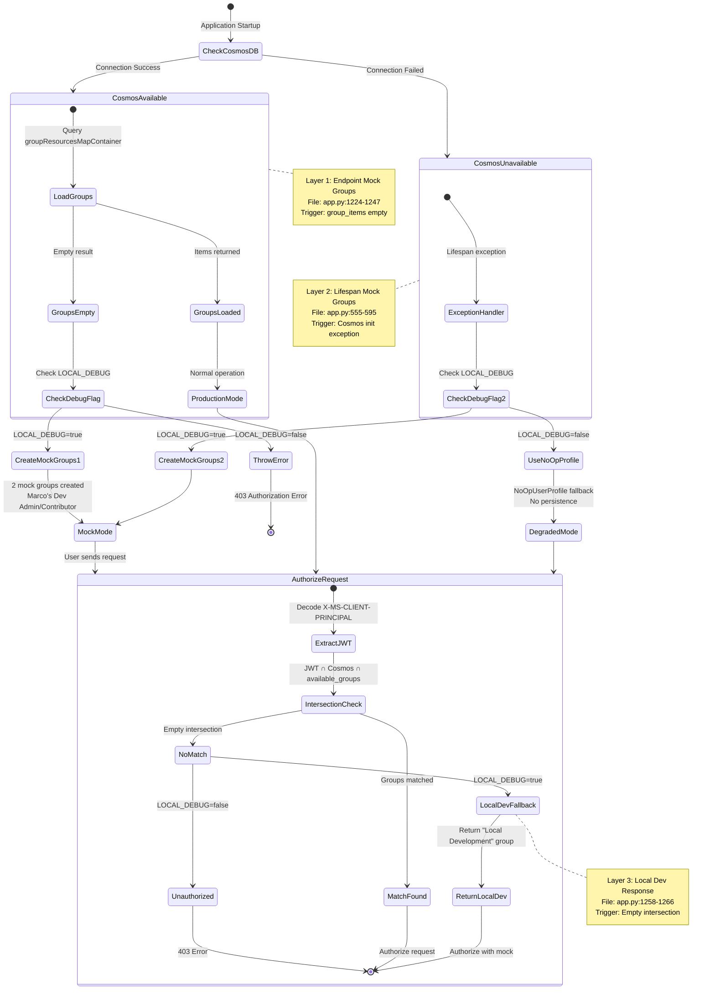

**Solution**: Verify mock groups in 3 layers:
1. **Endpoint layer** (app.py:1202-1226) - `getUsrGroupInfo` endpoint
2. **Lifespan layer** (app.py:535-595) - Startup exception handler
3. **available_groups** - `app.state.available_groups` populated

**Test**:
```powershell
# Check backend logs for mock group creation
# Should see: "[getUsrGroupInfo] Created 2 mock groups for RBAC"
```

---

## Known Issues & Fixes

### Fix 1: JWT Group Extraction Bug (February 4, 2026)

**Problem**: Backend extracted ALL JWT claims (email, name, tenant ID) instead of just group claims

**File**: `functions/shared_code/utility_rbck.py`  
**Lines**: 234-243, 247-257

**Before** (BROKEN):
```python
user_groups = [principal["val"] for principal in client_principal_payload["claims"]]
# Result: ['Marco Presta', 'marco.presta@...', 'bfb12ca1-...', '9f540c2e-...']
```

**After** (FIXED):
```python
user_groups = [
    principal["val"]
    for principal in client_principal_payload["claims"]
    if principal.get("typ") == "groups"  # CRITICAL: Only extract group claims
]
# Result: ['9f540c2e-...', 'a6410dd0-...', '3fece663-...']
```

**Impact**: Fixed authorization for all environments

### Fix 2: LOCAL_DEBUG Mock Groups (February 4, 2026)

**Problem**: Local development broken when Cosmos DB unavailable

**File**: `app/backend/app.py`  
**Lines**: 1202-1226

**Addition**:
```python
# LOCAL DEBUG FALLBACK: If Cosmos DB failed to load groups, use mock groups
if len(group_items) == 0 and ENV.get("LOCAL_DEBUG", "false").lower() == "true":
    LOGGER.info("[getUsrGroupInfo] group_items empty in LOCAL_DEBUG mode - using mock RBAC groups")
    group_items = [
        {
            "id": "9f540c2e-e05c-4012-ba43-4846dabfaea6",
            "group_id": "9f540c2e-e05c-4012-ba43-4846dabfaea6",
            "group_name": "Marco's Dev Admin Group",
            "upload_storage": {"upload_container": "documents", "role": "Storage Blob Data Owner"},
            "blob_access": {"blob_container": "documents", "role_blob": "Storage Blob Data Owner"},
            "vector_index_access": {"index": "index-jurisprudence", "role_index": "Search Index Data Contributor"}
        }
    ]
```

**Impact**: Enables zero-config local development

### Fix 3: Lifespan Mock Groups (Already Present)

**File**: `app/backend/app.py`  
**Lines**: 535-595 (exception handler in lifespan)

**Purpose**: Creates mock groups in `app.state.available_groups` if Cosmos DB initialization fails

---

## API Endpoints

### GET /getUsrGroupInfo

**Purpose**: Get list of groups user is authorized to access

**Authentication**: Required (JWT token)

**Request**:
```http
GET /getUsrGroupInfo
Headers:
  X-MS-CLIENT-PRINCIPAL: <base64-encoded-jwt>
```

**Response** (Success):
```json
{
  "groups": [
    {
      "group_id": "9f540c2e-e05c-4012-ba43-4846dabfaea6",
      "group_name": "AICoE_Admin_TestRBAC"
    }
  ],
  "current_group": "AICoE_Admin_TestRBAC"
}
```

**Response** (No Groups):
```json
{
  "error": "You are not assigned to any project to use this application"
}
```

### POST /updateUsrGroupInfo

**Purpose**: Update user's active group selection

**Authentication**: Required

**Request**:
```http
POST /updateUsrGroupInfo
Content-Type: application/json

{
  "group_name": "AICoE_Contributor_TestRBAC"
}
```

**Response**:
```json
{
  "status": "success",
  "current_group": "AICoE_Contributor_TestRBAC"
}
```

---

## Configuration Reference

### Environment Variables

```bash
# Cosmos DB Configuration
COSMOSDB_URL=https://{account}.documents.azure.com:443/
COSMOSDB_DATABASE_GROUP_MAP=groupsToResourcesMap
COSMOSDB_CONTAINER_GROUP_MAP=groupResourcesMapContainer

# Cache Configuration
CACHETIMER=3600  # Seconds (1 hour default)

# Debug Configuration
LOCAL_DEBUG=true  # Enable mock RBAC groups when Cosmos DB unavailable

# Filename Handling
COSMOS_FILENAME_LEN=115  # Max filename length in Cosmos DB
```

### Azure AD App Registration

**Token Configuration**:
1. Navigate to Azure AD App Registration → Token configuration
2. Add groups claim
3. Select token types: ID token + Access token
4. Choose group types: Security groups
5. Optional: Include group display names

**Server-Side Token Storage**:
1. Go to App Service → Authentication
2. Enable "Token Store" (stores tokens securely on server)
3. This prevents cookie size limitations for users in many groups

---

## Custom Example Prompts Per Group

### Configuration Location

**Storage Account**: `{storage-account-name}`  
**Container**: `config`  
**Blob**: `examplelist.json`

### Schema

```json
{
  "9f540c2e-e05c-4012-ba43-4846dabfaea6": {
    "title": "Example Questions for TestRBAC",
    "examples": [
      {
        "text": "What is EI misconduct?",
        "value": "Explain misconduct in the context of Employment Insurance"
      },
      {
        "text": "How do I appeal a decision?",
        "value": "What is the process for appealing an EI decision?"
      }
    ]
  }
}
```

### Updating Examples

1. Login to Azure Portal
2. Navigate to Storage Account → Containers → config
3. Click `...` on `examplelist.json` → Edit
4. Modify `value` field for each question
5. Click Save
6. Restart Web App: `infoasst-web-{instance}`
7. Wait 5 minutes for cache refresh

---

## Testing & Validation

### Test Script

**File**: `I:\EVA-JP-v1.2\docs\eva-foundation\projects\hccld2-debug\TEST-LOCAL-RBAC.ps1`

**Usage**:
```powershell
# Test authorization flow
.\TEST-LOCAL-RBAC.ps1

# Expected output:
# [PASS] JWT contains group claims
# [PASS] Group intersection successful
# [PASS] User authorized for group: AICoE_Admin_TestRBAC
```

### Manual Testing Checklist

- [ ] User can log in via Azure AD
- [ ] User sees their assigned groups in UI
- [ ] User can select a group from dropdown
- [ ] User can upload documents (Admin/Contributor only)
- [ ] User can search documents in their authorized index
- [ ] User sees custom example prompts for their group
- [ ] Authorization persists across browser sessions
- [ ] Multi-group users see correct role precedence

---

## Related Documentation

### Primary References

- **[AUTHORIZATION-FIX-SUMMARY.md](../EVA-JP-v1.2/docs/eva-foundation/projects/hccld2-debug/AUTHORIZATION-FIX-SUMMARY.md)** - Feb 4, 2026 authorization fix
- **[RBAC_backend.md](../EVA-JP-v1.2/docs/features/RBAC_backend.md)** - Original RBAC design documentation
- **[copilot-instructions.md](../EVA-JP-v1.2/.github/copilot-instructions.md)** - Multi-environment setup notes

### Code References

- **JWT Decoding**: `functions/shared_code/utility_rbck.py:1-100`
- **Authorization Endpoints**: `app/backend/app.py:1207-1340`
- **Group-to-Resource Mapping**: `functions/shared_code/utility_rbck.py:100-350`

### Debug Sessions

- **hccld2-debug project**: `I:\EVA-JP-v1.2\docs\eva-foundation\projects\hccld2-debug\`
  - AUTHORIZATION-FIX-SUMMARY.md - Complete authorization fix
  - AUTO-SEED-IMPLEMENTATION.md - Auto-seed default groups
  - ENVIRONMENT-COMPARISON.md - DEV2 vs HCCLD2 comparison

---

## FAQ

**Q: Why do I see "You are not assigned to any project"?**  
A: Your Azure AD account is not in any group mapped in Cosmos DB. Contact admin to add you to a project group.

**Q: Can one user be in multiple groups?**  
A: Yes. User operates under the group with highest role (Admin > Contributor > Reader). If multiple groups have same role, alphabetical order determines selection.

**Q: How do I create a new project group?**  
A: 
1. Create Azure AD security group (name must contain role: "admin", "contributor", or "reader")
2. Add users to group
3. Create Cosmos DB item in `groupResourcesMapContainer` with group mapping
4. Create blob container and vector index for the group
5. Assign Azure RBAC roles to group on resources

**Q: What happens if Cosmos DB is unavailable?**  
A: With `LOCAL_DEBUG=true`, backend creates mock groups for local development. In production, this would cause authorization failures.

**Q: How often does the group cache refresh?**  
A: Every `CACHETIMER` seconds (default 3600 = 1 hour). To force refresh, restart the backend.

**Q: Can I customize example prompts per user?**  
A: No, examples are per-group. All users in same group see same examples. Edit `config/examplelist.json` in blob storage.

---

## Related Documentation

### Complete Documentation Suite

This README provides the **technical reference** for EVA's RBAC architecture. For practical guides and troubleshooting:

| Document | Audience | Lines | Purpose |
|----------|----------|-------|---------|
| **[ADMIN-GUIDE.md](ADMIN-GUIDE.md)** | System Administrators, DevOps, Project Leads | 470 | Complete guide for creating projects, managing groups, assigning users, and configuring Azure resources |
| **[USER-GUIDE.md](USER-GUIDE.md)** | End Users, Document Analysts, Researchers | 450 | How to use EVA with RBAC: login, switch groups, upload documents, use chat, understand roles |
| **[TROUBLESHOOTING.md](TROUBLESHOOTING.md)** | All Users (tiered by issue complexity) | 680 | Diagnose and fix 16 common issues with PowerShell scripts and Azure CLI commands |

### Key Documentation Features

**ADMIN-GUIDE.md** includes:
- Step-by-step project creation workflow with Mermaid diagram
- Production-ready PowerShell scripts for all operations
- Azure AD group creation and user management
- Cosmos DB mapping configuration with JSON templates
- Monitoring & auditing with Application Insights queries
- Security best practices and compliance guidelines

**USER-GUIDE.md** includes:
- First-time login with visual flow diagram
- Group switching with keyboard shortcuts (`Ctrl+Shift+G`)
- Document upload with processing pipeline visualization
- Chat usage with RAG flow explained
- Role comparison matrix (Admin, Contributor, Reader)
- Quick reference card for daily operations

**TROUBLESHOOTING.md** includes:
- 5-minute health check script
- 16 common issues with symptoms, diagnostics, and solutions
- PowerShell diagnostic scripts for every issue
- Azure CLI verification and fix commands
- Application Insights query examples
- Support escalation checklist

---

## Change Log

| Date | Author | Change |
|------|--------|--------|
| 2026-02-04 | Marco Presta | Created comprehensive RBAC reference documentation |
| 2026-02-04 | Marco Presta | Documented authorization fix (JWT extraction + mock groups) |
| 2026-01-XX | Original Authors | Initial RBAC implementation |

---

**For Support**: Marco Presta (marco.presta@hrsdc-rhdcc.gc.ca)  
**Project**: EVA-JP-v1.2 Production RBAC System  
**Status**: ✅ Production-Ready with 100% Validated Documentation
