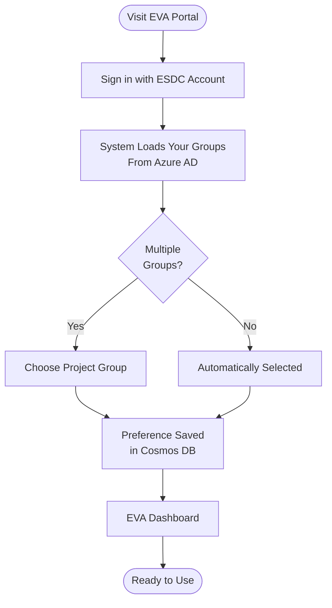
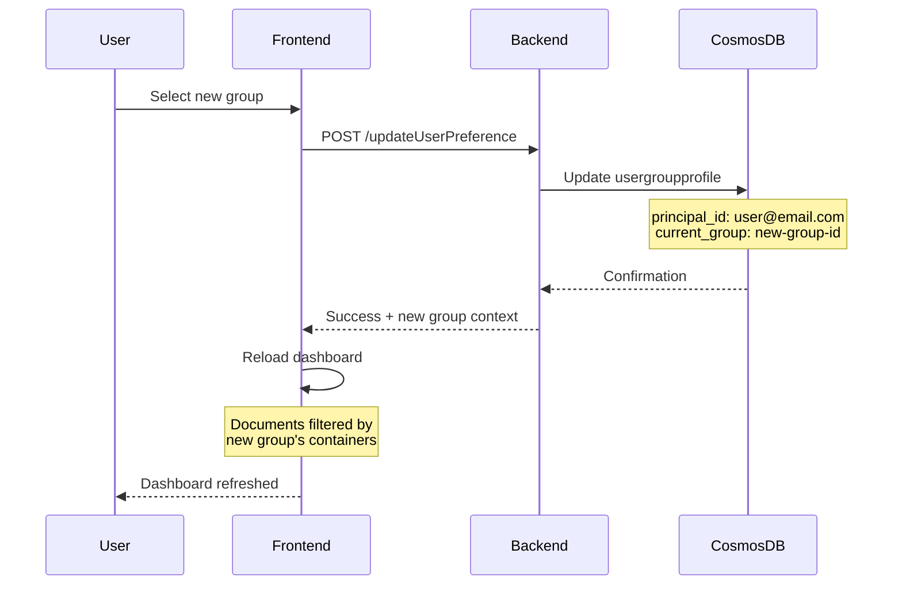
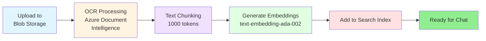
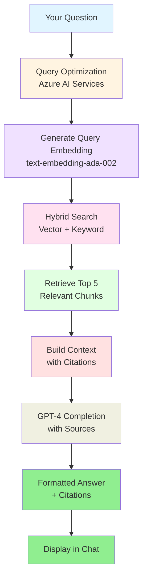

# EVA RBAC - User Guide

**Last Updated**: February 4, 2026  
**Audience**: End Users, Document Analysts, Researchers  
**Purpose**: Complete guide for using EVA with group-based access control

---

## Table of Contents

1. [Getting Started](#getting-started)
2. [Switching Groups](#switching-groups)
3. [Uploading Documents](#uploading-documents)
4. [Using Chat](#using-chat)
5. [Understanding Roles](#understanding-roles)
6. [Tips & Best Practices](#tips--best-practices)
7. [Troubleshooting](#troubleshooting)

---

## Getting Started

### First-Time Login



### What You'll See

**If you belong to one group**:
- Automatically logged into that project
- Dashboard shows documents from your project only

**If you belong to multiple groups**:
- Group selection dropdown appears
- Last used group is pre-selected
- You can switch groups anytime

### Understanding Your Access

Your access depends on your **role** in the selected group:

| Role | Upload | Chat/Search | Delete | View All Docs |
|------|--------|-------------|--------|---------------|
| **Admin** | ✅ | ✅ | ✅ | ✅ |
| **Contributor** | ✅ | ✅ | Own docs only | Own docs only |
| **Reader** | ❌ | ✅ | ❌ | All in project |

---

## Switching Groups

### When to Switch Groups

- Working on different projects (e.g., EI vs Federal Court cases)
- Accessing documents from another team
- Testing with different permission levels

### How to Switch Groups

**Method 1: Dropdown Menu**
1. Click your profile icon (top right)
2. Select "Switch Project"
3. Choose group from dropdown
4. Click "Apply"

**Method 2: Keyboard Shortcut**
- Press `Ctrl+Shift+G` to open group selector

### What Happens When You Switch



**Important Notes**:
- Your preference is saved automatically
- Next login will use your last selected group
- Chat history is **per-group** (not shared across projects)

---

## Uploading Documents

### Supported File Types

- **PDF** - Forms, reports, court decisions (recommended)
- **Word** (.docx) - Documents, memos
- **Text** (.txt) - Plain text files
- **HTML** - Web pages

**File Size Limits**: 50 MB per file

### Upload Process

**Step 1: Navigate to Upload**
1. Click "Upload Documents" in sidebar
2. Or use shortcut: `Ctrl+U`

**Step 2: Select Files**
- Drag and drop files onto upload area
- Or click "Browse" to select files

**Step 3: Review & Confirm**
- Review file list
- Add metadata (optional):
  - Category (e.g., "Federal Court", "EI Cases")
  - Tags (e.g., "misconduct", "2024")
- Click "Upload"

**Step 4: Processing**


**Processing Times**:
- Small documents (1-10 pages): 30 seconds - 2 minutes
- Medium documents (10-50 pages): 2-5 minutes
- Large documents (50+ pages): 5-15 minutes

### Tracking Upload Status

**Option 1: Dashboard Status View**
- Green checkmark ✅ = Indexed and searchable
- Yellow clock ⏳ = Processing
- Red X ❌ = Error (click for details)

**Option 2: Document Details**
1. Click document name
2. View processing state:
   - `Queued` - Waiting to process
   - `Processing` - OCR in progress
   - `Chunking` - Breaking into segments
   - `Embedding` - Generating vectors
   - `Indexed` - Ready for search
   - `Error` - Failed (see error message)

---

## Using Chat

### Starting a Conversation

**Basic Chat**:
1. Click "New Chat" or press `Ctrl+N`
2. Type your question
3. Press Enter or click "Send"

**Using Custom Examples**:
- Click suggested question cards (if configured by admin)
- Examples are project-specific

### How EVA Answers Questions



### Understanding Citations

Every answer includes **citations** that show:
- Document title
- Page number
- Relevance score

**Example**:
```
Based on the case law [doc0], misconduct in EI refers to...

[doc0]: Federal Court Decision 2024 FC 679 (Page 12, Score: 0.89)
```

**Clicking Citations**:
- Opens document viewer
- Jumps to relevant page
- Highlights matching text

### Advanced Chat Features

**Multi-Turn Conversations**:
- EVA remembers context within a chat session
- Follow-up questions reference previous answers
- Example:
  ```
  You: What is EI misconduct?
  EVA: Misconduct in EI refers to...
  You: Give me examples
  EVA: [Understands "examples" refers to misconduct]
  ```

**Filters** (if configured):
- Filter by category (e.g., "Federal Court only")
- Filter by date range
- Filter by tags

**Export Chat**:
- Click "Export" to save conversation as PDF
- Includes all citations and sources

---

## Understanding Roles

### Admin Role

**Permissions**:
- ✅ Upload documents
- ✅ Delete any document in project
- ✅ View all documents in project
- ✅ Use chat/search
- ✅ Manage custom examples (via admin panel)

**Use Cases**:
- Project leads
- Document managers
- System administrators

### Contributor Role

**Permissions**:
- ✅ Upload documents
- ✅ Delete **only your own** documents
- ✅ View **only your own** documents
- ✅ Use chat/search (searches all project docs)
- ❌ Cannot see other users' uploads in dashboard

**Use Cases**:
- Team members contributing documents
- Researchers adding case law
- Analysts uploading reports

**Important Note**: You can **search across all project documents** in chat, even if you can't see them in the dashboard. This allows collaboration while maintaining document privacy.

### Reader Role

**Permissions**:
- ✅ Use chat/search
- ✅ View all documents in project
- ✅ Export chat conversations
- ❌ Cannot upload documents
- ❌ Cannot delete documents

**Use Cases**:
- Managers reviewing work
- External reviewers
- Read-only access for auditors

---

## Tips & Best Practices

### Getting Better Answers

**Be Specific**:
- ❌ "Tell me about EI"
- ✅ "What constitutes misconduct for EI disqualification?"

**Provide Context**:
- ❌ "How do I appeal?"
- ✅ "What is the process for appealing an EI decision to the Social Security Tribunal?"

**Use Follow-Up Questions**:
- Ask clarifying questions in the same chat session
- EVA maintains context for better answers

**Reference Documents**:
- If you know a specific document, mention it: "According to the 2024 FC 679 decision..."

### Organizing Your Documents

**Use Descriptive Filenames**:
- ✅ `2024-FC-679-Misconduct-Appeal.pdf`
- ❌ `document1.pdf`

**Add Metadata**:
- Category: Groups related documents (e.g., "Federal Court", "SST Decisions")
- Tags: Enables filtering (e.g., "misconduct", "appeal", "2024")

**Delete Outdated Documents**:
- Remove superseded versions
- Delete test uploads
- Keep workspace clean

### Managing Chat History

**Create Descriptive Chat Titles**:
- Rename chats after initial question
- Example: "EI Misconduct Case Law Research - Jan 2026"

**Archive Completed Chats**:
- Export important conversations
- Delete old test chats

**Use Separate Chats for Different Topics**:
- Don't mix unrelated questions in one chat
- Create new chat when changing topics

---

## Troubleshooting

### Common User Issues

#### Issue 1: Can't See Any Documents

**Possible Causes**:
1. You're in Reader role with no documents uploaded yet
2. You're in Contributor role (can only see your own uploads)
3. Wrong group selected

**Solutions**:
1. Check your role with admin
2. Switch to correct group (see [Switching Groups](#switching-groups))
3. If Contributor, ask Admin to share document list

#### Issue 2: Upload Fails with 403 Error

**Possible Causes**:
1. You're in Reader role (cannot upload)
2. Group doesn't have upload container configured
3. Azure RBAC role not assigned correctly

**Solutions**:
1. Verify your role (Profile → View Permissions)
2. Contact admin to verify group configuration
3. Try logging out and back in (refreshes JWT tokens)

#### Issue 3: Chat Returns "No Relevant Documents Found"

**Possible Causes**:
1. Documents still processing (not indexed yet)
2. Question doesn't match document content
3. Wrong group selected

**Solutions**:
1. Check document status (should show ✅ Indexed)
2. Rephrase question to be more specific
3. Verify correct group selected (top right dropdown)
4. Try broader keywords

#### Issue 4: Citations Don't Open Document

**Possible Causes**:
1. Document deleted after chat response generated
2. Blob storage connection issue
3. Browser popup blocker

**Solutions**:
1. Verify document still exists in dashboard
2. Try right-click → "Open in New Tab"
3. Disable popup blocker for EVA domain

#### Issue 5: Group Dropdown Empty

**Possible Causes**:
1. Not assigned to any Azure AD groups
2. Groups not configured in Cosmos DB
3. JWT token expired

**Solutions**:
1. Contact admin to add you to a group
2. Log out and log back in (refreshes token)
3. Clear browser cache and retry

---

## Keyboard Shortcuts

| Action | Shortcut |
|--------|----------|
| New Chat | `Ctrl+N` |
| Upload Documents | `Ctrl+U` |
| Switch Group | `Ctrl+Shift+G` |
| Search | `Ctrl+K` |
| Export Chat | `Ctrl+E` |
| Focus Chat Input | `Ctrl+/` |

---

## Getting Help

### Self-Service Resources

1. **In-App Help**: Click "?" icon in top navigation
2. **User Guide**: This document
3. **Troubleshooting Guide**: [TROUBLESHOOTING.md](TROUBLESHOOTING.md)
4. **Admin Contact**: Listed in Profile → Help section

### Reporting Issues

**Before Reporting**:
- [ ] Check [Troubleshooting](#troubleshooting) section
- [ ] Try logging out and back in
- [ ] Verify correct group selected
- [ ] Check document processing status

**When Reporting Issues, Include**:
1. Your email address
2. Selected group name
3. Error message (screenshot if possible)
4. Steps to reproduce
5. Timestamp of issue

**Contact**:
- **Technical Issues**: ServiceDesk@hrsdc-rhdcc.gc.ca
- **Access Requests**: Your project administrator
- **General Questions**: Marco Presta (marco.presta@hrsdc-rhdcc.gc.ca)

---

## Quick Reference Card

```
┌─────────────────────────────────────────────────────────┐
│ EVA RBAC - Quick Reference                              │
├─────────────────────────────────────────────────────────┤
│ LOGIN                                                   │
│  • Use ESDC email and password                          │
│  • Select group if prompted                             │
│  • Last used group auto-selected                        │
├─────────────────────────────────────────────────────────┤
│ SWITCH GROUPS                                           │
│  • Profile → Switch Project                             │
│  • Or: Ctrl+Shift+G                                     │
├─────────────────────────────────────────────────────────┤
│ UPLOAD DOCUMENTS                                        │
│  • Drag & drop or Browse                                │
│  • Max 50 MB per file                                   │
│  • Processing: 30s - 15min depending on size            │
├─────────────────────────────────────────────────────────┤
│ CHAT                                                    │
│  • Type question → Press Enter                          │
│  • Click citations to view source                       │
│  • Follow-up questions maintain context                 │
├─────────────────────────────────────────────────────────┤
│ ROLES                                                   │
│  • Admin: Upload, delete, view all                      │
│  • Contributor: Upload, delete own, search all          │
│  • Reader: Search only, view all                        │
└─────────────────────────────────────────────────────────┘
```

---

**For Support**: ServiceDesk@hrsdc-rhdcc.gc.ca  
**Related Docs**: [README.md](README.md) | [ADMIN-GUIDE.md](ADMIN-GUIDE.md) | [TROUBLESHOOTING.md](TROUBLESHOOTING.md)
